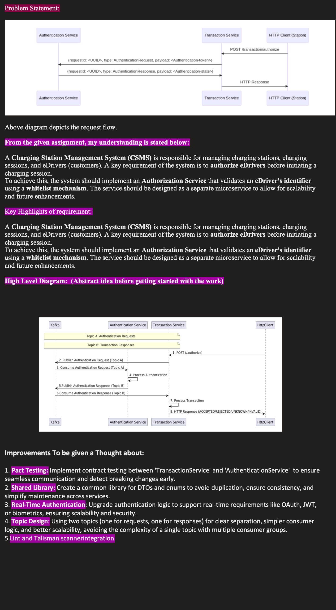

# CSMS Assignment

This project consists of two Spring Boot applications:

- **Transaction Service**: Runs on port `8080`.
- **Authentication System**: Runs on port `8081`.

Both applications are backed by an **H2 Database**, and **Kafka** is used for message processing.

## System Requirements

To run this project locally, you'll need the following:

1. **Docker** to run Kafka using Docker Compose.
2. **JDK 21** to run the Spring Boot applications.
3. **Gradle** for building the project.
4. **Kotlin** as the dependency injection framework used in the project.

## Steps to Run the Services

### 1. Kafka Setup with Docker Compose

To bring up Kafka, we are using Docker Compose. Follow these steps:

1. Navigate to the folder containing the `docker-compose.yml` file for Kafka.
2. Run the following command to start Kafka:

   ```bash
   docker-compose up -d


